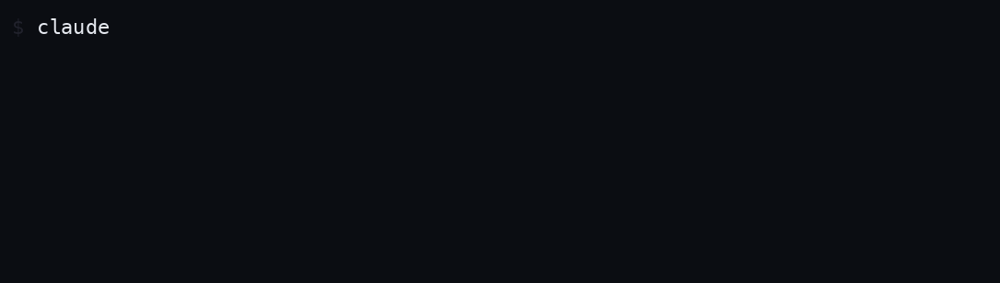

# Pinglet 💌

**AI가 생각하는 동안, 다른 개발자의 한 줄을 만나세요.**

Claude Code가 코드를 고치는 동안 "Befuddling…" 스피너만 바라보던 그 자리에,
다른 개발자들이 남긴 짧은 메시지(**Ping**)가 대신 표시됩니다.



```
✶ 💌 "금요일 오후 배포는 다음 생에 합시다." (12s · ↓ 1.2k tokens)
```

🌐 **홈페이지**: https://pinglet.halluci.co.kr

🇺🇸 [English](./README.md) · 🇯🇵 [日本語](./README.ja.md)

## 시작하기

```bash
npm install -g pinglet-cli && pinglet install
```

이게 전부입니다. 이후는 평소처럼 `claude`를 실행하기만 하면 돼요.

> 설치 중 npm이 `install-scripts` 경고를 보여줄 수 있습니다 — 구버전 npm에서
> 초기 설정을 자동화하던 스크립트에 대한 안내로, 무시해도 됩니다.
> 연결 상태는 `pinglet doctor`로 언제든 확인할 수 있어요.

- 기존 statusline 설정이 있다면 **백업 후 교체할지 물어보고**, 제거 시 원래대로 복원합니다.
- Codex도 지원합니다(experimental) — turn 완료 시 macOS 알림으로 Ping이 도착합니다.
  알림 방식이 시끄러울 수 있어 기본 설치에서는 제외되며, 원할 때만 `pinglet install --codex`로 켜세요.

## Ping 보내기

Claude Code 세션 안에서 바로:

```
> /pinglet 오늘도 빌드가 초록불이길
```

또는 터미널에서:

```bash
pinglet login          # GitHub 로그인 — 브라우저가 열리고 자동으로 완료됩니다 (최초 1회)
pinglet post "메시지"
```

읽기는 로그인 없이 가능하고, **작성에만 GitHub 로그인이 필요합니다.**

지금 몇 개의 터미널이 함께 켜져 있는지는 statusline에서 보여줍니다:

```
🟢 지금 41개 터미널과 함께 코딩 중
```

statusline 언어는 위치(시스템 타임존)에 따라 자동 선택됩니다 — 한국은 한국어, 일본은 일본어, 그 외는 영어.

## 명령어

| 명령 | 설명 |
|---|---|
| `pinglet install` | Claude Code 연결 (Codex는 `--codex`로 opt-in) |
| `pinglet login` | GitHub 계정 연결 (메시지 작성에 필요) |
| `pinglet post "메시지"` | Ping 보내기 |
| `pinglet ping` | 지금 표시될 메시지 미리보기 |
| `pinglet doctor` | 설치·연결 상태 진단 |
| `pinglet uninstall` | 연결 해제 및 기존 설정 복원 |

## 안심하고 쓰세요

- **토큰 사용량 0** — 메시지는 Claude Code의 UI 영역(statusline/spinner)에만
  표시되고 모델 컨텍스트에는 전혀 들어가지 않습니다. API 비용과 응답 품질에
  영향이 없습니다.
- **코드를 읽지 않습니다** — prompt, 응답, 코드, 환경변수에 접근하지 않습니다.
  수집하는 것은 설치 ID, OS 종류, 클라이언트 버전, 메시지 노출 이벤트뿐입니다.
- **터미널이 느려지지 않습니다** — 표시는 로컬 캐시만 읽어서 그리며, 네트워크는
  백그라운드에서만 사용합니다. 오프라인에서도 동작합니다.
- **모든 메시지는 검수를 거칩니다** — URL·개인정보·제어문자·부적절한 표현은
  자동으로 걸러지며, 문제가 되는 메시지는 발견 시 바로 내려주세요
  (아래 문의·피드백 링크).

## 제거

```bash
pinglet uninstall            # 연결 해제 + 기존 설정 복원 (npm 제거보다 먼저!)
npm uninstall -g pinglet-cli
```

로컬 데이터(`~/.pinglet`)까지 지우려면 `pinglet uninstall --purge`.

## 약관 및 개인정보처리방침

로그인하여 메시지를 작성하면 아래 문서에 동의한 것으로 간주됩니다.

- [이용약관](https://pinglet.halluci.co.kr/terms) · [개인정보처리방침](https://pinglet.halluci.co.kr/privacy)

문의·피드백: halluci-data@naver.com · [GitHub Issues](https://github.com/mabyko/pinglet-client/issues)
